# Diagrama de Clases: MDDocumentEditor y Componentes de Visualización

## Descripción General

Este diagrama muestra la arquitectura de clases del editor de documentos Markdown basado en RecycleView, incluyendo todas las clases que participan en la visualización y edición de líneas markdown.

## Diagrama UML

```mermaid
classDiagram
    %% ========================================
    %% CLASE PRINCIPAL: MDDocumentEditor
    %% ========================================
    class MDDocumentEditor {
        <<RecycleView>>
        +BooleanProperty filter
        +StringProperty filter_txt
        +BooleanProperty filter_up
        +BooleanProperty search
        +UndoManager undo_manager
        +dict data_items
        +list _md_lines
        +list _selected_indexs
        +int _active_index
        +tuple _cursor
        +bool _mode_editor
        +SelectableRecycleBoxLayout layout

        +__init__(activate_background, **kwargs)
        +initialize_document()
        +apply_data_items()
        +populate_from_md_lines(md_lines)
        +on_filter(instance, value)
        +on_filter_txt(instance, value)
        +on_filter_up(instance, value)
        +on_search(instance, value)
        +on_hotlight_item(item, state)
    }

    %% ========================================
    %% LAYOUTS
    %% ========================================
    class SelectableRecycleBoxLayout {
        <<RecycleBoxLayout>>
        +__init__(**kwargs)
    }

    %% ========================================
    %% ITEM EDITOR DE LÍNEAS
    %% ========================================
    class MDDocumentLineEditor {
        <<RecycleDataViewBehavior>>
        +NumericProperty num_line
        +BooleanProperty hotlight
        +ListProperty fill_sel_pos
        +ListProperty fill_sel_size
        +int index
        +MDLine md_line
        +DataThemed di_themed
        +DataShow di_show
        +DataState di_state
        +BoxLayout _layout
        +MDDLSpace wg_space
        +MDDLDrag wg_drag_hook
        +MDDLNumberLine wg_number_line
        +MDDLTree_hook wg_tree_hook
        +MDDLInfoBar wg_info_bar
        +MDLineEditor wg_line_editor
        +GSelectItem graphic_select
        +GActiveItem graphic_active
        +GHotlightItem graphic_hotlight

        +__init__()
        +show_number_line(value, num_line)
        +show_tree_hook(value)
        +show_info_bar(value)
        +show_editor(show, anim, cursor)
        +select(value, anim, anim_type)
        +activate(value, show_editor, cursor, anim, anim_type)
        +refresh_view_attrs(rv, index, data)
        +on_mouse_move(instance, mp)
        +on_touch_down(touch)
        +on_touch_up(touch)
        +_update_height()
        +_on_update_geometry(instance, value)
    }

    %% ========================================
    %% EDITOR DE LÍNEA MARKDOWN
    %% ========================================
    class MDLineEditor {
        <<FloatLayout>>
        +BooleanProperty mode_editor
        +ObjectProperty line
        +StringProperty md_text
        +ObjectProperty type
        +MDLineTextInput md_editor
        +BaseMDLabel active_label
        +FloatLayout _layout_editor
        +FloatLayout _layout_label

        +__init__(line, non_focus)
        +show_editor(show, cursor)
        +show_anim_editor(show, cursor)
        +update_type()
        +on_txt_change(instance, value)
        +_create_label_by_type(md_type)
        +_on_resize_label(instance, value)
    }

    %% ========================================
    %% ENTRADA DE TEXTO MARKDOWN
    %% ========================================
    class MDLineTextInput {
        <<TextInput>>
        +ObjectProperty line
        +StringProperty md_text

        +__init__(line, **kwargs)
        +get_cursor_from_xy(x, y)
        +on_text(instance, value)
        +keyboard_on_key_down(window, keycode, text, modifiers)
        +keyboard_on_key_up(window, keycode)
    }

    %% ========================================
    %% WIDGETS AUXILIARES DE LÍNEA
    %% ========================================
    class MDDLDrag {
        <<Widget>>
        +size_hint_x: None
        +width: 10
    }

    class MDDLNumberLine {
        <<Label>>
        +size_hint_x: None
        +width: 38
        +StringProperty text
    }

    class MDDLTree_hook {
        <<Widget>>
        +size_hint_x: None
        +width: 16
    }

    class MDDLInfoBar {
        <<Widget>>
        +size_hint_x: None
        +width: 80
    }

    class MDDLSpace {
        <<Widget>>
        +size_hint_x: None
        +width: 6
    }

    %% ========================================
    %% MODELO DE DATOS
    %% ========================================
    class MDDocument {
        <<Model>>
        +str document
        +str path_doc
        +str doc_name
        +list~MDLine~ _md_lines

        +load_doc(path, doc_name)
        +save_doc()
        +save_as_doc(path, doc_name)
        +separate_lines()
        +join_lines()
        +append_line(md_text_line)
        +insert_line(id_line, md_text_line)
        +remove_line(md_line)
        +move_line_up(md_line)
        +move_line_down(md_line)
        +update_type_line(md_line)
        +get_first_title()
    }

    class MDLine {
        <<EventDispatcher>>
        +ObjectProperty type
        +StringProperty md_text
        +NumericProperty num_line
        +MDLine prev_line
        +MDLine next_line
        +TranslateMarkdownToKVMarkup tranlate_markup

        +__init__(md_text, prev_line, next_line, type, num_line)
        +get_tab_level()
        +get_title_level()
        +get_title_Childs()
        +get_title_parent()
        +get_title_prev()
        +get_title_next()
        +get_list_Childs()
        +get_list_parent()
        +get_markup_text(extensions)
        +update_type()
        +on_type(instance, new_type)
        +on_txt_change(instance, value)
    }

    class MD_LINE_TYPE {
        <<Enumeration>>
        TEXT
        TITLE
        HEAD_TITLE
        UNDERLINE_TITLE
        SEPARATOR
        LIST
        ORDER_LIST
        TASK
        TODO
        TABLE
        BLOCKQUOTE
        IMAGEN
        CODE
        START_CODE
        END_CODE
    }

    %% ========================================
    %% LABELS DE VISUALIZACIÓN MARKDOWN
    %% ========================================
    class BaseMDLabel {
        <<Abstract>>
        +StringProperty md_text
        +TranslateMarkdownToKVMarkup _translate

        +__init__(**kwargs)
        +update()*
        +on_md_text(instance, value)
    }

    class MDTextLabel {
        <<Label>>
        +StringProperty md_text
        +bool markup
        +str halign
        +str valign
        +tuple color
        +int font_size

        +__init__(**kwargs)
        +update()
    }

    class MDSeparatorLabel {
        <<Widget>>
        +__init__(**kwargs)
        +update()
    }

    class MDHeadLabel {
        <<Label>>
        +__init__(**kwargs)
    }

    class MDTaskLabel {
        <<MDTextLabel>>
        +__init__(**kwargs)
    }

    class MDToDoLabel {
        <<MDTextLabel>>
        +__init__(**kwargs)
    }

    class MDTableLabel {
        <<GridLayout>>
        +int cols

        +__init__(html_table)
        +update()
    }

    class MDImageLabel {
        <<MDTextLabel>>
        +__init__(**kwargs)
    }

    class MDCodeLabel {
        <<MDTaskLabel>>
        +__init__(**kwargs)
    }

    %% ========================================
    %% DATA ITEMS
    %% ========================================
    class DataLineMDD {
        +MDLine md_line
        +DataThemed data_themed
        +DataShow data_show
        +DataState data_state

        +to_dict()
    }

    class DataThemed {
        +theme colors
        +theme properties
    }

    class DataShow {
        +bool number_line
        +bool tree
        +bool infobar
    }

    class DataState {
        +bool selected
        +bool active
        +bool mode_editor
        +bool editable
        +int index
    }

    %% ========================================
    %% GRÁFICOS
    %% ========================================
    class GSelectItem {
        +MDDocumentLineEditor widget

        +show(value)
        +animate_fade(value)
        +animate_up(value)
        +animate_down(value)
        +update_graphics()
    }

    class GActiveItem {
        +MDDocumentLineEditor widget

        +show(value)
        +animate(value)
        +update_graphics()
    }

    class GHotlightItem {
        +MDDocumentLineEditor widget

        +show(value)
        +animate(value)
        +update_graphics()
    }

    %% ========================================
    %% RELACIONES DE COMPOSICIÓN
    %% ========================================
    MDDocumentEditor *-- SelectableRecycleBoxLayout : layout
    MDDocumentEditor o-- MDDocument : usa
    MDDocumentEditor o-- "0..*" DataLineMDD : data_items

    SelectableRecycleBoxLayout o-- "0..*" MDDocumentLineEditor : children

    MDDocumentLineEditor *-- MDLineEditor : wg_line_editor
    MDDocumentLineEditor *-- MDDLDrag : wg_drag_hook
    MDDocumentLineEditor *-- MDDLSpace : wg_space
    MDDocumentLineEditor o-- MDDLNumberLine : wg_number_line
    MDDocumentLineEditor o-- MDDLTree_hook : wg_tree_hook
    MDDocumentLineEditor o-- MDDLInfoBar : wg_info_bar
    MDDocumentLineEditor *-- GSelectItem : graphic_select
    MDDocumentLineEditor *-- GActiveItem : graphic_active
    MDDocumentLineEditor *-- GHotlightItem : graphic_hotlight
    MDDocumentLineEditor o-- MDLine : md_line
    MDDocumentLineEditor *-- DataThemed : di_themed
    MDDocumentLineEditor *-- DataShow : di_show
    MDDocumentLineEditor *-- DataState : di_state

    MDLineEditor *-- MDLineTextInput : md_editor
    MDLineEditor o-- BaseMDLabel : active_label
    MDLineEditor o-- MDLine : line

    MDLineTextInput o-- MDLine : line

    MDDocument *-- "0..*" MDLine : _md_lines

    MDLine o-- MDLine : prev_line
    MDLine o-- MDLine : next_line
    MDLine o-- MD_LINE_TYPE : type

    DataLineMDD *-- MDLine : md_line
    DataLineMDD *-- DataThemed : data_themed
    DataLineMDD *-- DataShow : data_show
    DataLineMDD *-- DataState : data_state

    %% ========================================
    %% RELACIONES DE HERENCIA
    %% ========================================
    BaseMDLabel <|-- MDTextLabel
    BaseMDLabel <|-- MDSeparatorLabel
    BaseMDLabel <|-- MDHeadLabel
    BaseMDLabel <|-- MDTableLabel

    MDTextLabel <|-- MDTaskLabel
    MDTextLabel <|-- MDToDoLabel
    MDTextLabel <|-- MDImageLabel

    MDTaskLabel <|-- MDCodeLabel

    %% ========================================
    %% RELACIONES DE USO
    %% ========================================
    MDLineEditor ..> BaseMDLabel : crea según tipo
    MDLineEditor ..> MDTextLabel : crea
    MDLineEditor ..> MDSeparatorLabel : crea
    MDLineEditor ..> MDHeadLabel : crea
    MDLineEditor ..> MDTaskLabel : crea
    MDLineEditor ..> MDToDoLabel : crea
    MDLineEditor ..> MDTableLabel : crea
    MDLineEditor ..> MDImageLabel : crea
    MDLineEditor ..> MDCodeLabel : crea
```



## Descripción de Componentes

### 1. **MDDocumentEditor** (Clase Principal)
- **Hereda de:** RecycleView, FocusBehavior, ThemableBehavior
- **Función:** Contenedor principal que gestiona la visualización de todo el documento usando RecycleView
- **Características:**
  - Maneja filtrado y búsqueda de líneas
  - Gestiona la selección y activación de items
  - Mantiene el estado del documento completo
  - Implementa undo/redo con UndoManager

### 2. **SelectableRecycleBoxLayout**
- **Hereda de:** RecycleBoxLayout
- **Función:** Layout que organiza verticalmente los MDDocumentLineEditor
- **Características:**
  - Recicla widgets para mejor performance
  - Gestiona el tamaño dinámico basado en contenido

### 3. **MDDocumentLineEditor**
- **Hereda de:** RecycleDataViewBehavior, ThemeWidget, HotlightEventDispatcher
- **Función:** Widget que representa una línea individual del documento
- **Componentes visuales:**
  - `wg_drag_hook`: Handle para arrastrar líneas (MDDLDrag)
  - `wg_space`: Espaciador visual (MDDLSpace)
  - `wg_number_line`: Número de línea (MDDLNumberLine) - opcional
  - `wg_tree_hook`: Indicador de jerarquía (MDDLTree_hook) - opcional
  - `wg_info_bar`: Barra de información (MDDLInfoBar) - opcional
  - `wg_line_editor`: Editor de la línea (MDLineEditor)
- **Gráficos canvas:**
  - `graphic_select`: Efecto de selección (GSelectItem)
  - `graphic_active`: Efecto de línea activa (GActiveItem)
  - `graphic_hotlight`: Efecto de hover (GHotlightItem)
- **Funciones principales:**
  - `show_number_line()`: Muestra/oculta número de línea
  - `show_tree_hook()`: Muestra/oculta gancho de árbol
  - `show_info_bar()`: Muestra/oculta barra de información
  - `show_editor()`: Alterna entre modo visualización y edición
  - `select()`: Selecciona la línea (con animación opcional)
  - `activate()`: Activa la línea para edición
  - `refresh_view_attrs()`: Actualiza el widget cuando cambia data

### 4. **MDLineEditor**
- **Hereda de:** FloatLayout
- **Función:** Maneja la visualización y edición de una línea markdown
- **Modos:**
  - **Modo Visualización:** Muestra un label renderizado (BaseMDLabel)
  - **Modo Edición:** Muestra un input de texto (MDLineTextInput)
- **Funciones principales:**
  - `show_editor()`: Cambia instantáneamente entre modos
  - `show_anim_editor()`: Cambia con animación entre modos
  - `update_type()`: Actualiza el tipo de línea y crea el label correspondiente
  - `_create_label_by_type()`: Fabrica el label según MD_LINE_TYPE

### 5. **MDLineTextInput**
- **Hereda de:** TextInput
- **Función:** Input de texto especializado para edición de markdown
- **Características:**
  - Vinculado a un objeto MDLine
  - Maneja eventos de teclado para markdown
  - Función `get_cursor_from_xy()` para posicionar cursor según coordenadas

### 6. **Widgets Auxiliares de Línea**

#### MDDLDrag
- Widget de 10px de ancho para arrastrar líneas
- Siempre visible

#### MDDLNumberLine
- Label de 38px que muestra el número de línea
- Opcional (controlado por `show_number_line()`)

#### MDDLTree_hook
- Widget de 16px para mostrar jerarquía de documento
- Opcional (controlado por `show_tree_hook()`)

#### MDDLInfoBar
- Widget de 80px para información adicional
- Opcional (controlado por `show_info_bar()`)

#### MDDLSpace
- Espaciador de 6px entre componentes

### 7. **Modelo de Datos**

#### MDDocument
- Gestiona el documento markdown completo
- Mantiene lista enlazada de MDLine
- Operaciones: load, save, append, insert, remove, move
- Función `update_type_line()`: Detecta tipo mediante regex

#### MDLine
- Representa una línea individual
- Estructura de lista doblemente enlazada (prev_line, next_line)
- Propiedades: type, md_text, num_line
- Navegación jerárquica:
  - Títulos: `get_title_parent()`, `get_title_Childs()`, `get_title_next()`, `get_title_prev()`
  - Listas: `get_list_parent()`, `get_list_Childs()`
- Procesamiento: `update_type()`, `get_markup_text()`

#### MD_LINE_TYPE
- Enumeración con 15 tipos de líneas markdown
- Tipos: TEXT, TITLE, HEAD_TITLE, SEPARATOR, LIST, ORDER_LIST, TASK, TODO, TABLE, BLOCKQUOTE, IMAGEN, CODE, etc.

### 8. **Labels de Visualización**

Jerarquía de herencia:
```
BaseMDLabel (abstracta)
├── MDTextLabel (texto general, títulos, listas)
│   ├── MDTaskLabel (tareas [ ])
│   │   └── MDCodeLabel (código)
│   ├── MDToDoLabel (todo items)
│   └── MDImageLabel (imágenes)
├── MDSeparatorLabel (líneas separadoras)
├── MDHeadLabel (encabezados subrayados)
└── MDTableLabel (tablas con GridLayout)
```

**Funciones principales:**
- `update()`: Renderiza el texto markdown a markup de Kivy
- `on_md_text()`: Evento cuando cambia el texto

**Características:**
- Usan `TranslateMarkdownToKVMarkup` para traducción
- Sistema de extensiones para formatos especiales
- Ajuste automático de altura según contenido

### 9. **Data Items**

#### DataLineMDD
- Contenedor de datos para RecycleView
- Método `to_dict()` convierte a diccionario para data

#### DataThemed
- Información de tema (colores, estilos)

#### DataShow
- Flags de visibilidad de componentes:
  - `number_line`: bool
  - `tree`: bool
  - `infobar`: bool

#### DataState
- Estado del item:
  - `selected`: bool
  - `active`: bool
  - `mode_editor`: bool
  - `editable`: bool
  - `index`: int

### 10. **Gráficos Canvas**

#### GSelectItem
- Dibuja efecto de selección
- Animaciones: fade, up, down

#### GActiveItem
- Dibuja línea gruesa en borde izquierdo
- Indica línea actualmente activa

#### GHotlightItem
- Dibuja líneas superior e inferior en hover
- Responde a eventos de mouse

## Flujo de Datos

### Carga de Documento
```
MDDocument.load_doc()
  → separate_lines()
    → crea lista de MDLine (linked list)
      → MDDocumentEditor.populate_from_md_lines()
        → crea DataLineMDD para cada MDLine
          → apply_data_items() (aplica filtros)
            → RecycleView.data actualizado
              → SelectableRecycleBoxLayout renderiza MDDocumentLineEditor
```

### Edición de Línea
```
Usuario hace click en línea
  → MDDocumentLineEditor.on_touch_up()
    → activate(show_editor=True)
      → MDLineEditor.show_editor(True)
        → Oculta active_label (BaseMDLabel)
          → Muestra md_editor (MDLineTextInput)
            → Usuario edita texto
              → MDLineTextInput.on_text()
                → MDLine.md_text actualizado
                  → MDLine.update_type()
                    → MDLineEditor.update_type()
                      → Crea nuevo label según tipo
```

### Renderización de Línea
```
MDLine.md_text (markdown)
  → MDLine.type detectado por regex
    → MDLineEditor._create_label_by_type()
      → Crea clase específica (MDTextLabel, MDTableLabel, etc.)
        → BaseMDLabel.update()
          → TranslateMarkdownToKVMarkup.translate()
            → Label con markup de Kivy renderizado
```

## Patrones de Diseño Utilizados

1. **RecycleView Pattern**: Reutilización de widgets para listas grandes
2. **Linked List**: MDLine como nodos de lista doblemente enlazada
3. **Factory Pattern**: `_create_label_by_type()` crea labels según tipo
4. **Observer Pattern**: Kivy Properties disparan eventos (on_text, on_type)
5. **Strategy Pattern**: TranslateMarkdownToKVMarkup con extensiones
6. **Composite Pattern**: Jerarquía de widgets (MDDocumentLineEditor contiene múltiples sub-widgets)
7. **State Pattern**: mode_editor alterna entre visualización y edición

## Notas de Implementación

1. **Performance:**
   - RecycleView solo renderiza widgets visibles
   - Widgets se reciclan al hacer scroll
   - Linked list permite navegación eficiente

2. **Sincronización:**
   - `refresh_view_attrs()` sincroniza data → view
   - Eventos de Kivy Properties mantienen consistencia

3. **Extensibilidad:**
   - Nuevos tipos de línea: agregar a MD_LINE_TYPE y crear MDLabel correspondiente
   - Nuevos formatos: agregar extensiones a TranslateMarkdownToKVMarkup

4. **Filtrado:**
   - `data_items` contiene todos los items
   - `data` contiene solo items filtrados
   - `apply_data_items()` aplica lógica de filtro

## Funciones Clave por Responsabilidad

### Gestión de Documento
- `MDDocument.load_doc()`, `save_doc()`, `separate_lines()`, `join_lines()`

### Manipulación de Líneas
- `MDDocument.append_line()`, `insert_line()`, `remove_line()`, `move_line_up()`, `move_line_down()`

### Detección de Tipos
- `MDDocument.update_type_line()`, `MDLine.update_type()`

### Visualización
- `MDDocumentEditor.populate_from_md_lines()`, `apply_data_items()`
- `MDDocumentLineEditor.refresh_view_attrs()`, `show_editor()`
- `MDLineEditor.update_type()`, `show_editor()`, `show_anim_editor()`

### Navegación Jerárquica
- `MDLine.get_title_parent()`, `get_title_Childs()`, `get_list_parent()`, etc.

### Renderización
- `BaseMDLabel.update()`, `TranslateMarkdownToKVMarkup.translate()`

### Interacción
- `MDDocumentLineEditor.on_touch_up()`, `activate()`, `select()`
- `MDLineTextInput.keyboard_on_key_down()`

### Animaciones
- `GSelectItem.animate_fade()`, `animate_up()`, `animate_down()`
- `GActiveItem.animate()`, `GHotlightItem.animate()`
- `MDLineEditor.show_anim_editor()`
