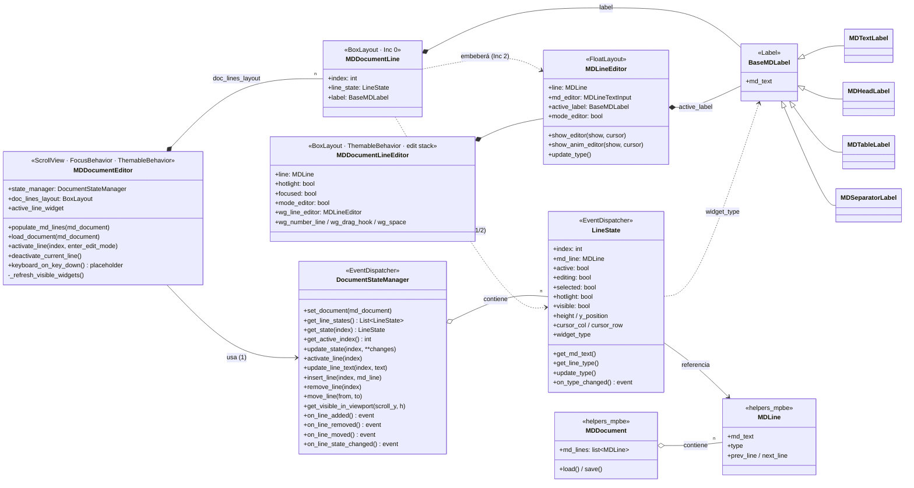
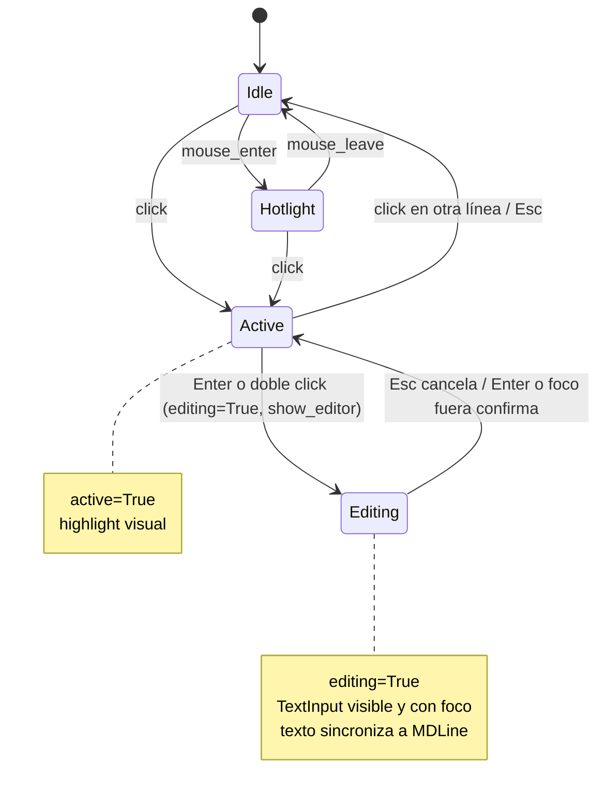
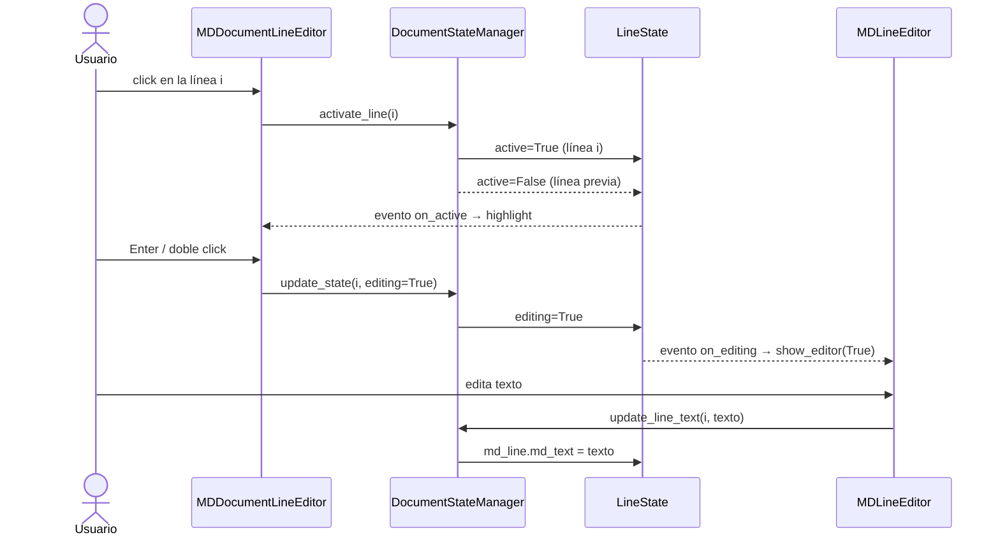
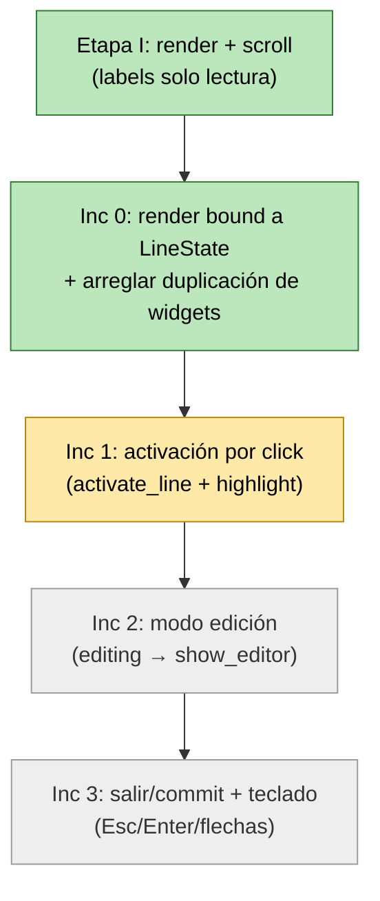

# MDDocumentEditor V2 — Arquitectura (documento vivo)

**Módulo:** `kivy_mpbe_widgets/wg_markdown2`
**Última actualización:** 2026-06-30
**Estado:** Etapa I completa · Etapa II (edición) en progreso

Este es el documento **vivo**: refleja el código real y se actualiza en cada
incremento. El diseño original (con detalles ya superados) está en
[MDDocumentEditor_V2_Arquitectura.md](MDDocumentEditor_V2_Arquitectura.md).

> Los diagramas son **Mermaid**. Se renderizan en GitHub y en VS Code con la
> extensión *Markdown Preview Mermaid Support*.

---

## 1. Diagrama de clases (estado real)

> **Estado (Inc 0):** el coordinador ya instancia un `MDDocumentLine` por línea
> (fila liviana que envuelve el label de render y guarda su `LineState`).
> **Falta para editar:** que `MDDocumentLine` **observe** su `LineState`
> (reaccionar a `active` en Inc 1 y a `editing` en Inc 2, embebiendo el
> `MDLineEditor` existente). Esa es la conexión punteada aún pendiente.

---

## 2. Estados de una línea (UI)

Estado combinado de las propiedades `hotlight`, `active` y `editing` de
`LineState`. La transición a `editing` reusa `MDLineEditor.show_editor()`.

---

## 3. Flujo: click → activar → editar (objetivo Etapa II)

---

## 4. Roadmap de incrementos (Etapa II — edición)

Avanzamos **de a uno**, verificando en la app antes de seguir.

| # | Incremento | Estado | Verificación |
|---|-----------|--------|--------------|
| I | Render + scroll (labels) | ✅ Hecho | El documento se ve renderizado |
| 0 | Render bound a `LineState` + fix duplicación | ✅ Hecho | Cada línea es un `MDDocumentLine` atado a su `LineState`; el scroll ya no duplica |
| 1 | Activación por click | 🟡 En curso | Click resalta la línea; la anterior se apaga |
| 2 | Modo edición (`editing` → `show_editor`) | ⬜ Pendiente | Se puede tipear; el texto queda en el documento |
| 3 | Salir/commit + teclado | ⬜ Pendiente | Esc cancela, Enter confirma, flechas navegan |

### Bugs/incompletos conocidos
- ✅ ~~`populate_md_lines` y `_refresh_visible_widgets` duplican widgets~~ → resuelto en Inc 0 (construcción única + `_refresh_visible_widgets` no-op).
- ✅ ~~`initialize_document` usa atributos no inicializados~~ → resuelto en Inc 0 (limpieza segura).
- `activate_line` llama `doc_lines_layout.get_widget(index)`, pero `doc_lines_layout` es un `BoxLayout` plano sin ese método → **Inc 1** (usar el mapa `_line_widgets`).
- `load_document()` (camino alternativo, no usado por la app) llama `state_manager._load_document(md_lines)` con argumento, pero el método ya no lo recibe → revisar si se unifica con `populate_md_lines`.
