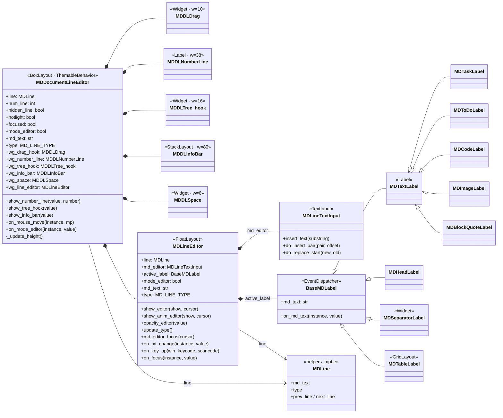

# Referencia — `MDDocumentLineEditor` (stack de edición completo)

Diagrama de clases del **widget de línea editable completo** de `wg_markdown2`
(`widgets/md_line_editor.py` + `widgets/md_line_widgets.py` + `widgets/md_inputs.py`
+ labels de `helpers_mpbe.markdown_document.md_labels`).

Sirve de **referencia** para reusar sus piezas y animaciones al codificar la
edición/navegación en el `MDDocumentEditor` V2 (que hoy usa el `MDDocumentLine`
liviano). Se renderiza con la extensión *Markdown Preview Mermaid Support*.



## Composición visual de la fila (izquierda → derecha)

```
[MDDLDrag][MDDLNumberLine][MDDLTree_hook][MDDLInfoBar][MDDLSpace][ MDLineEditor .......... ]
   w=10        w=38            w=16          w=80        w=6      (label render + input overlay)
```

- `MDDLDrag`: manija para arrastrar/reordenar (drag & drop).
- `MDDLNumberLine`: número de línea (bordes verticales).
- `MDDLTree_hook`: gancho del árbol/jerarquía de títulos.
- `MDDLInfoBar`: barra de información.
- `MDDLSpace`: separador.
- `MDLineEditor`: el editor real (label de render + `MDLineTextInput` superpuesto,
  con `show_editor()` / `show_anim_editor()` y sincronización de texto en vivo).

## Qué reusar en V2

- **`MDLineTextInput`**: ya reusado en `MDDocumentLine` (Inc 2).
- **`MDLineEditor.show_editor` / `show_anim_editor`**: mecánica de overlay + fade
  (referencia para pulir la animación de entrada/salida de edición).
- **Sub-widgets** (`MDDLNumberLine`, `MDDLTree_hook`, `MDDLInfoBar`, `MDDLDrag`):
  candidatos a incorporar a `MDDocumentLine` cuando se agreguen número de línea,
  árbol de títulos, drag & drop, etc.
